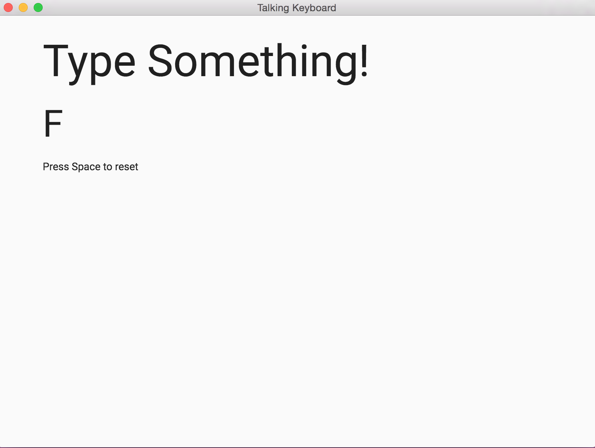

# Talking keyboard


This is a simple app that spells the letters you type on your keyboard.
It also plays a weird sound when you press the space bar.

This is based on this tutorial
https://medium.freecodecamp.org/how-to-build-your-first-app-with-electron-41ebdb796930
Read it.




## To Use

To clone and run this repository you'll need [Git](https://git-scm.com) and [Node.js](https://nodejs.org/en/download/) (which comes with [npm](http://npmjs.com)) installed on your computer. From your command line:

```bash
# Clone this repository
git clone https://github.com/carlosballadares/talking-kbd
# Go into the repository
cd talking-kbd
# Install dependencies
npm install
# Run the app
npm start
```
